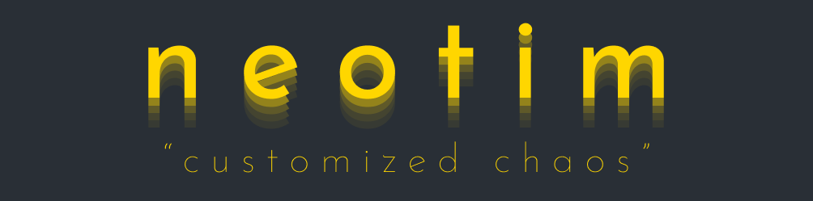

Semi-minimalistic neovim configuration. 

> This configuration was heavily inspired by [the Primeagen](https://www.youtube.com/watch?v=w7i4amO_zaE).

## Requirements
 - [neovim (v0.8.x)](https://github.com/neovim/neovim/releases/tag/v0.7.2)
 - [Nerd Fonts](https://www.nerdfonts.com/font-downloads)
 - [npm](https://github.com/npm/cli) for downloading packages of LSP language servers
 - ripgrep (for [telescope](https://github.com/nvim-telescope/telescope.nvim) plugin)
 - GCC and g++

## Installation

0. Backup  existing configuration

1. Clone repository into `~/.config/nvim/`

```sh
git clone git@github.com:timrekelj/neotim ~/.config/nvim
```

2. Start neovim and install packages with `:Lazy`

> [!TIP]
> If you want to learn more about this configuration, here are [keybindings](./docs/keybindings.md) and [configuration structure](./docs/structure.md)
