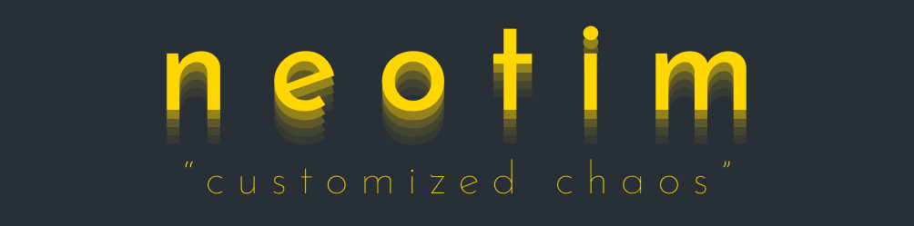

Semi-minimalistic neovim configuration. 

> This configuration was heavily inspired by [the Primeagen](https://www.youtube.com/watch?v=w7i4amO_zaE).

## Requirements
 - [neovim (v0.8.x)](https://github.com/neovim/neovim/releases/tag/v0.7.2)
 - [Nerd Fonts](https://www.nerdfonts.com/font-downloads)
 - [npm](https://github.com/npm/cli) for downloading packages of LSP language servers
 - ripgrep (for [telescope](https://github.com/nvim-telescope/telescope.nvim) plugin)
 - GCC and g++

## Installation

0. Backup  existing configuration

1. Clone repository into `~/.config/nvim/`

```sh
git clone git@github.com:timrekelj/neotim ~/.config/nvim
```

2. Start neovim and install packages with `:Lazy`

## Keybindings

I tried keeping up with my keybindings changes but I always forgot at least one change so you should browse through files to see the keybindings.

## Treesitter Parsers

Native Neovim (0.11+) includes tree-sitter but doesn't ship a parser installer.
You need to manually compile parsers and install their query files.

### Steps (using Go as an example)

1. Create the parser directory:

```sh
mkdir -p ~/.local/share/nvim/site/parser/
```

2. Clone the grammar repo and compile:

```sh
git clone https://github.com/tree-sitter/tree-sitter-go /tmp/tree-sitter-go
cd /tmp/tree-sitter-go && cc -o ~/.local/share/nvim/site/parser/go.so -shared src/parser.c -Os -I./src
```

3. Copy the query files:

```sh
mkdir -p ~/.local/share/nvim/site/queries/go
cp /tmp/tree-sitter-go/queries/*.scm ~/.local/share/nvim/site/queries/go/
```

4. Clean up:

```sh
rm -rf /tmp/tree-sitter-go
```

5. Restart Neovim — the language will now use treesitter highlighting.

### For other languages

Replace `tree-sitter-go` with the appropriate repo (e.g. `tree-sitter-lua`, `tree-sitter-javascript`). The query files may live in `queries/` or `runtime/queries/<lang>/` depending on the repo.
